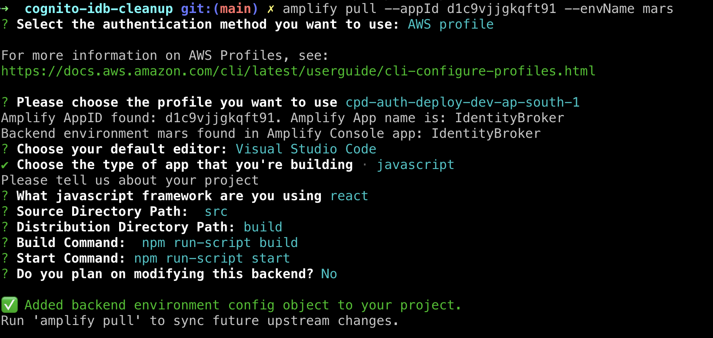
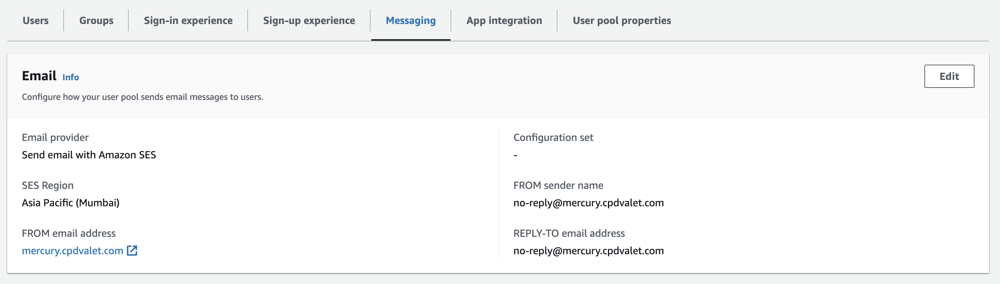
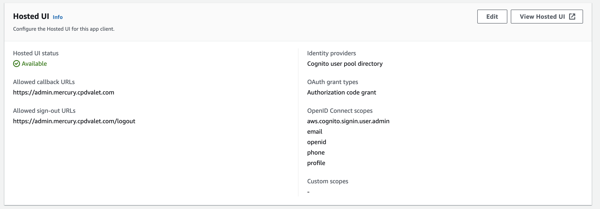
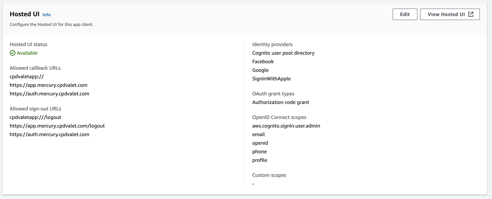

# AWS Environment and Application Deployment Guide for Authentication Portal

> Note: This deployment guide is based on as on date version of AWS and other related tools, and may need to be updated as the versions of these components are changed

## Prerequisites:

In order to deploy the portal you would need:

-   An AWS account with appropriate permissions.
-   Domain name for the target application deployment.
-   AWS CLI installed with administrator credentials ([installation-link](https://docs.aws.amazon.com/cli/latest/userguide/getting-started-install.html))
-   AWS Amplify CLI ([installation-link](https://docs.amplify.aws/cli/start/install)) installed and configured
-   Working understanding of following platform / tools / components
    -   AWS Amplify and AWS Amplify CLI
    -   AWS Cognito
    -   Setting up Social SignIn with Facebook, Google and Apple

## Step 1: Create a Hosted Zone in Route 53

1. Sign in to the AWS Management Console.

2. Open the Amazon Route 53 console.

3. Choose "Create Hosted Zone."

4. Enter your domain name and configure your DNS settings as needed.

5. Save the Hosted Zone.

## Step 2: Register NS Records with Parent Zone

1. Obtain the NS records for the Hosted Zone created in Step 1.

2. Contact your domain registrar or the organization responsible for your parent zone (e.g., your domain provider).

3. Provide them with the NS records from Step 2.1 and request they update your parent zone with these records.

## Step 3: Add Hosted Zone as Verified Entity in SES

1. Open the Amazon SES console.

2. In SES, verify the domain you created in Step 1.

3. Depending on your use case, you may need to repeat this process in multiple AWS regions (one for incoming emails, another for application deployment).

## Step 4: Use AWS Amplify CLI to Deploy the Authentication Environment

1. Install the AWS Amplify CLI if you haven't already ([installation-link](https://docs.amplify.aws/cli/start/install)).

2. Navigate to your application's source code directory.
3. Install all dependencies

    ```
    pnpm install
    ```

4. Connect with AWS Amplify App

    The command below connects with `mars` enviroment. To see list of other defined environments, please visit [AWS Amplify Console](https://ap-south-1.console.aws.amazon.com/amplify/home?region=ap-south-1#/d1c9vjjgkqft91)

    ```
    amplify pull --appId d1c9vjjgkqft91 --envName mars
    ```

    To see a list of the other commands to manage Amplify Environments visit [env command docs](https://docs.amplify.aws/cli/commands/env/)

    

5. Publish the app
   This command will create all the backend resources and the hosting bucket plus cloudfront distribution that will host the broker

    ```
    amplify publish
    ```

    - when prompted set `BASE_DN` value to domain you created in Step 1, and
    - set `PROJECT_NAME` value to `cpdvalet`

    > Note: During deployment process you would also be required to provide additional details on social identity providers
    >
    > - Facebook => App Id & APP Secret
    > - Google => ClientID and Secret
    > - Apple => Services ID [`cpdvalet.com`], Team ID, Key ID, and Private Key

6. AWS Amplify will create the following AWS assets for your Authentication Portal:

    - AWS Cognito Identity Pool
    - AWS Cognito User Pool
    - 2x AWS Cognito User Pool Applications (for Participant App and Admin App)
    - Deploy the required AWS Lambda Functions
    - AWS API Gateway for Authentication Portal with API Key
    - AWS CloudFront for Authentication Portal
    - AWS S3 Bucket for storing Authentication Portal Code
    - Sets up following SSM Parameters for later use
        - `/cpdvalet/<<deployment domain>>/auth/auth_key`
        - `/cpdvalet/<<deployment domain>>/auth/auth_url`
        - `/cpdvalet/<<deployment domain>>/auth/cognito_pool_arn`
        - `/cpdvalet/<<deployment domain>>/auth/app_client_id`
        - `/cpdvalet/<<deployment domain>>/auth/admin_client_id`
        - `/cpdvalet/<<deployment domain>>/auth/identity_pool_id`
        - `/cpdvalet/<<deployment domain>>/auth/api_gw_authorizer_arn`

7. Follow the Amplify deployment process and provide the necessary configuration.

## Step 5: Configure SES as Default Email Sender in AWS Cognito User Pool

1. Open the Amazon Cognito console.

2. Select your User Pool.

3. Under "Messaging," configure the following (refer screenshot):

-   Email Provider: `Send email with Amazon SES`
-   SES Region: `Your deployment region`
-   FROM email address: `<<Deployment Domain>>`
-   FROM sender name: `no-reply@<<deployment domain>>`
-   REPLY-TO email address: `no-reply@<<deployment domain>>`

6. Save your changes.



## Step 6: Validate App clients configuration

1. In the Amazon Cognito console, select your User Pool.

2. Under "App integration," validate the `participant_app` and `admin_app` for following information (refer screenshot):

    - Allowed callback URLs: This should be set to `https://admin.<<deployment domain>>` for admin_app and `https://app.<<deployment domain>>`, `cpdvaletapp://` for participant app. Remove all localhost based urls
    - Allowed sign-out URLs: This should be set to `https://admin.<<deployment domain>>/logout` for admin_app and `https://app.<<deployment domain>>/logout`, `cpdvaletapp:///logout` for participant app. Remove all localhost based urls
    - Identity providers: Remove social providers from admin_app. These are automatically added by Amplify

3. Configure the no-reply email address as needed.
4. Save your changes.
   
   

## Conclusion

Your Authentication Portal is now deployed and configured in the AWS environment.
